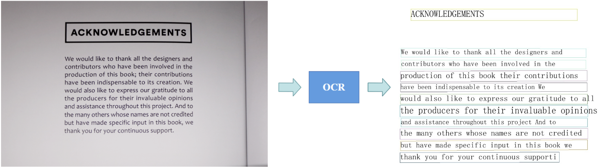
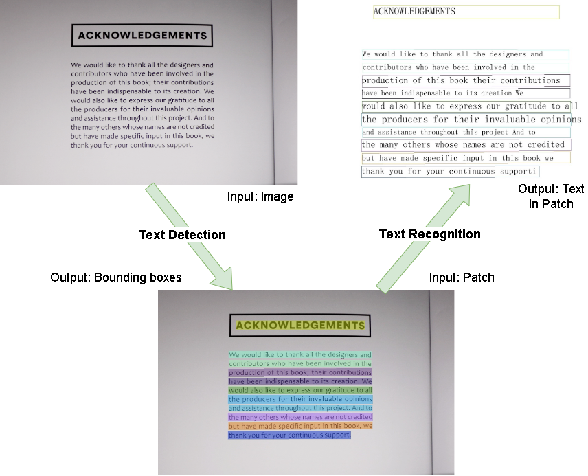
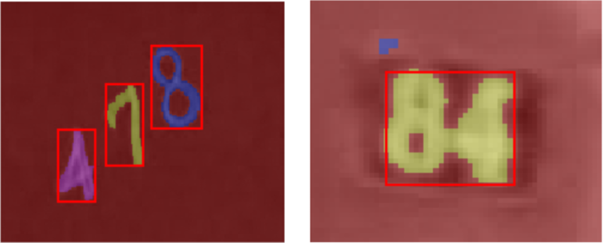
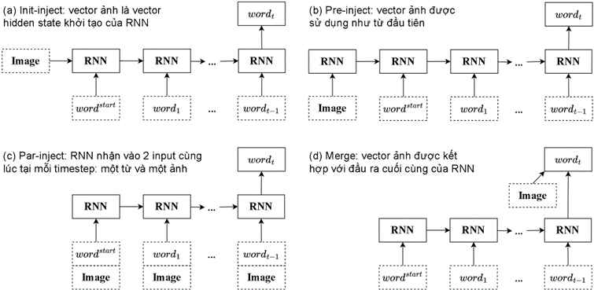

# Nhận dạng ký tự quang học (OCR)

## I. Giới thiệu

Nhận dạng ký tự quang học (_Optical Character Recognition_ – OCR) đề cập đến 1 tập hợp các vấn đề về thị giác máy tính với mục đích chuyển đổi các hình ảnh kỹ thuật số hoặc hình ảnh tài liệu được scan thành dưới dạng văn bản mà máy tính có thể xử lý, lưu trữ và chỉnh sửa được như 1 tập tin văn bản thông thường hoặc dưới dạng 1 phần của phần mềm nhập liệu.

Nói dông dài vậy thôi chứ 1 cách dễ hiểu thì `OCR` đơn giản chỉ là 1 bài toán chuyển đổi đầu vào là 1 ảnh có text, thành đầu ra là các text trong ảnh đó dưới dạng kỹ thuật số. Các hình ảnh có thể bao gồm tài liệu, hóa đơn, biểu mẫu pháp lý, chứng minh thư hoặc những thứ trong môi trường tự nhiên (_OCR in the wild_) như biển báo đường phố, biển số xe, ...

Dù thường không được chú ý, nhưng `OCR` là 1 trợ giúp không thể thay thế khi ta nói về tự động hóa. Nó giúp loại bỏ các quy trình không cần thiết của các tài liệu giấy, cho phép ta phân loại, sắp xếp, lưu trữ, quản lý và chia sẻ thông tin, đồng thời tránh các rủi ro bảo mật liên quan đến bản chất vật lý của các tài liệu giấy.

Ngoài ra, tự động hóa dựa trên `OCR` không chỉ là chia sẻ thông tin dưới dạng kỹ thuật số. Khi có nhiều tài liệu, các loại máy móc có thể sử dụng chúng làm mục nhập dữ liệu để tìm kiếm các mẫu và xu hướng. Việc trực quan hóa cũng trở nên dễ dàng hơn: nếu ta cần 1 biểu đồ, lược đồ hoặc bảng tính, thì việc sử dụng các tài liệu kỹ thuật số sẽ nhanh hơn nhiều so với việc biên soạn 1 báo cáo trực quan bằng tay.

`OCR` cho phép ta dành ít thời gian hơn để xử lý từng tài liệu mới, tiết kiệm chi phí nhân lực và thay vào đó tập trung vào các chiến lược gia tăng giá trị. Đây là 1 chủ đề phức tạp vì nó là sự dụng hòa giữa 2 lĩnh vực lớn trong AI:

-   Thị giác máy tính (_Computer Vision_ – CV): huấn luyện các mô hình học máy để nhìn và giải thích hình ảnh theo cách tương tự như cách con người thực hiện.
-   Xử lý ngôn ngữ tự nhiên (_Natural Language Processing_ – NLP): chủ yếu xử lý văn bản hay các dữ liệu chuyển giọng nói thành văn bản và tập trung vào việc dạy cho máy tính hiểu lời nói của con người.

### 1. Các khái niệm cơ bản

Thường có sự pha trộn qua lại giữa 3 khái niệm: nhận dạng ký tự quang (_Optical Character Recognition_ – `OCR`), nhận dạng ký tự thông minh (_Intelligent Character Recognition_ – `ICR`) và thu thập dữ liệu thông minh (_Intelligent Data Capture_ – `IDC`). Một số nguồn có xu hướng sử dụng các thuật ngữ này như các từ đồng nghĩa, nhưng có một sự khác biệt khá rõ ràng giữa chúng.

Thuật ngữ `OCR` thông thường được sử dụng phổ biến nhất cho văn bản trong các tài liệu in tiêu chuẩn, có cấu trúc. `ICR` là một phiên bản tiên tiến hơn của `OCR` được sử dụng cho các văn bản viết tay (handwritten), do sự phát triển của các công nghệ `OCR` hiện đại, các nhà khoa học dữ liệu và các kỹ sư hiếm khi phân biệt 2 hình thức thu thập dữ liệu tự động này. `IDC` đại diện cho các thuật toán được xây dựng để tự động hóa tốt hơn `OCR` vào các quy trình kinh doanh, nó kết hợp khả năng nhận dạng của `OCR` với việc giải thích dữ liệu (_Data Interpretation_) cho phép phân loại tài liệu và cả điểm nhập liệu.

Hiện tại, `OCR` không chỉ giới hạn ở nhận dạng văn bản tài liệu hoặc sách mà còn bao gồm các hình ảnh chứa văn bản được chụp trong các môi trường hỗn tạp hay không đồng nhất, hình thành nên các vấn đề như background phức tạp, nhiễu, ánh sáng, font chữ khác nhau và biến dạng hình học trong ảnh, ...

### 2. Phân loại hình ảnh chứa văn bản

Các thách thức trong `OCR` phát sinh chủ yếu do các tác vụ `OCR` đang thực hiện. Trên mạng mình có thấy nhiều bài viết phân loại các hình ảnh chứa văn bản này thành 2 loại (Có và Phi cấu trúc) nhưng mình thấy chia như vậy vẫn còn khá nhập nhằng và nhiều chỗ chưa được rõ ràng nên mình sẽ chia các tác vụ này thành 3 loại:

-   **Có cấu trúc** (_Structured_): văn bản trong các tài liệu được đánh máy, có background sạch, đồng nhất, font chữ theo tiêu chuẩn, ít nhiễu (_Noise_), hàng lối rõ ràng, có một trật tự nhất định và thường có mật độ văn bản (_Density_) cao.
    
-   **Phi cấu trúc** (_Unstructured_): đây là loại ảnh nhiều khó khăn nhất, văn bản sẽ ở những vị trí ngẫu nhiên trong ảnh hay trong một hoạt cảnh tự nhiên (_OCR in the wild_), thường có mật độ văn bản thưa thớt, cấu trúc hàng lối bất định, background phức tạp, và không có font chuẩn. Dữ liệu kiểu này cũng có thể được chia thành 3 loại nhỏ khác:
    -   **Graphic text**: ảnh có văn bản được thêm vào sau khi đã có ảnh như phụ đề của video, …
    -   **Scene text**: ảnh có văn bản xuất hiện trong tự nhiên, tức văn bản là thành phần có sẵn trong ảnh. Các dữ liệu loại này có nhiều thách thức như về hướng (_Orientation_), loại font, điều kiện ánh sáng hay độ lệch (_Skewness_) của chữ. Tác vụ OCR cho dữ liệu loại này còn gọi là **Scene Text Recognition** – `STR`.
        
    -   **Synthetic text**: khá giống với **Graphic text**, đây là một ý tưởng khá hay để cải thiện hiệu suất của quá trình huấn luyện bằng cách tạo dữ liệu giả bằng máy tính. Việc sinh các ký tự hoặc từ ngẫu nhiên lên một hình ảnh sẽ có vẻ tự nhiên hơn nhiều so với bất kỳ vật thể nào khác vì tính chất phẳng của văn bản. Các bộ dataset cho dữ liệu loại này cũng vượt trội về khả năng tạo ra các ngôn ngữ khác nhau, ngay cả những ngôn ngữ khó, chẳng hạn như tiếng Trung, tiếng Do Thái, tiếng Ả Rập, …
        
-   **Lai** giữa có và phi cấu trúc (_Hybrid_): thường là các bản scan, photocopy không phải ở dạng đánh máy của các tài liệu, sách, có cấu trúc tốt, background ít phức tạp, gọn gàng, thường có mật độ văn bản cao hơn so với các ảnh chứa văn bản phi cấu trúc nhưng có hướng nghiêng và độ lệch nhỏ. Ngoài ra, đối với loại văn bản như các tư liệu lịch sử thì còn có thể có sự những thay đổi lớn và mơ hồ do sự khác nhau về nét chữ giữa từng người hay chất lượng ảnh có thể bị giảm dần theo thời gian.

### 3. OCR và Deep Learning

`OCR` là 1 trong những nhiệm vụ thị giác máy tính được giải quyết sớm nhất vì ở khía cạnh nào đó, nó không cần tới _Deep Learning_, do đó đã có những cách triển khai `OCR` khác nhau ngay cả trước khi _Deep Learning_ bùng nổ vào năm 2012. Điều này khiến nhiều người nghĩ rằng các bài toán `OCR` đã được “giải”, nó không còn là 1 thách thức nữa và việc sử dụng Deep Learning cho `OCR` là 1 việc làm quá mức cần thiết.

Trên thực tế, `OCR` chỉ mang lại kết quả tốt trong các trường hợp cụ thể và đúng là có những giải pháp tốt cho 1 số tác vụ `OCR` không yêu cầu Deep Learning. Rất nhiều kỹ thuật trước đó đã giải quyết vấn đề `OCR` cho văn bản có cấu trúc bằng 1 số kỹ thuật thị giác máy tính truyền thống hay các phương pháp xử lý ảnh căn bản như bộ lọc hình ảnh, hình thái học (_morphology_) và phát hiện cạnh (_contour_) để từ đó phân loại 1 vùng ảnh là chữ gì, … Các kỹ thuật này chỉ hoạt động tốt trên các tập dữ liệu hẹp, theo khuôn mẫu (_template-based_), không thay đổi nhiều về hướng, vị trí văn bản hay chất lượng hình ảnh, … nhưng chúng không hoạt động đúng với các môi trường ảnh không bị ràng buộc khác, có mật độ văn bản nhỏ hơn hay có các thuộc tính khác với dữ liệu có cấu trúc, …

Nhìn chung, đây vẫn được xem là thách thức, để làm cho các mô hình trở nên mạnh mẽ với các biến thể trên, giúp các doanh nghiệp có thể triển khai các ứng dụng học máy của họ trên quy mô lớn, các giải pháp mới cần được đưa ra. Các phương pháp tiếp cận bằng _Deep Learning_ đã được cải thiện trong vài năm qua, làm hồi sinh mối quan tâm đến vấn đề `OCR`, nơi mạng nơ-ron có thể kết hợp các tác vụ xác định văn bản trong 1 hình ảnh và hiểu văn bản đó là gì. _Deep Learning_ có thể được xem là bắt buộc để tiến tới các giải pháp tốt hơn và tổng quát hơn.

### 4. Các bước triển khai chính

Có 2 mức độ để triển khai các tác vụ `OCR`: mức chuỗi (_sequence level_) và mức ký tự (_character level_). Ngày nay, mức chuỗi thường được ưa chuộng hơn do mức ký tự đòi hỏi chi phí gán nhãn quá lớn vì cần phải vẽ `bounding box` cho từng ký tự, từ đó dễ xuất hiện nhiều vấn đề nan giải hơn như `bounding box` giữa 2 ký tự liên tiếp có thể không rõ ràng hoặc bị đè lên nhau (overlap), ... Tiếp theo, người ta cũng chia `OCR` thành 2 bài toán con chính:

-   **Phát hiện văn bản** (_Text Detection_): phát hiện vùng ảnh có chứa văn bản. Đầu vào là ảnh, đầu ra là các `bounding box` bao quanh các phần văn bản được tìm thấy trên ảnh.
-   **Nhận dạng văn bản** (_Text Recognition_): sau khi detect được các `bounding box` hay các vùng ảnh có chứa văn bản, ta tách riêng từng vùng ảnh này ra từ ảnh gốc, tạo thành các phần ảnh nhỏ còn gọi là các `Patch`. Đầu vào lúc này sẽ là `Patch` và đầu ra là văn bản có trong `Patch` đó.

    

### 5. Một số dataset cho văn bản phi cấu trúc

Có rất nhiều bộ dữ liệu hình ảnh có sẵn cho các văn bản phi cấu trúc và cho tiếng Anh, nhưng sẽ khó hơn để tìm bộ dữ liệu giống vậy cho các ngôn ngữ khác hay không phải cho văn bản phi cấu trúc. Các bộ dữ liệu khác nhau trình bày các tác vụ khác nhau cần giải quyết. Dưới đây là một vài bộ dữ liệu nổi tiếng:

-   [SVHN](http://ufldl.stanford.edu/housenumbers/): bộ dữ liệu về số nhà được trích xuất từ Google Street View. Các chữ số có nhiều hình dạng và kiểu viết khác nhau; tuy nhiên, mỗi số nhà được đặt ở giữa hình. Ảnh có độ phân giải không cao và cách sắp xếp của chúng có thể hơi kỳ lạ.
-   ICDAR [2013](https://paperswithcode.com/dataset/icdar-2013) và [2015](https://paperswithcode.com/dataset/icdar-2015): 2 bộ dữ liệu dành cho hội nghị và cuộc thi ICDAR. Đây là 2 bộ dữ liệu benchmark tiêu chuẩn dùng để đánh giá rất nhiểu mô hình phục vụ các tác vụ OCR cho ảnh có văn bản gần nằm ngang. Ngoài ra còn có các phiên bản cho những năm khác như [2003](https://paperswithcode.com/dataset/icdar-2003) hay [2019](https://rrc.cvc.uab.es/?ch=15), tuy nhiên các bản năm [2013](https://paperswithcode.com/dataset/icdar-2013) và [2015](https://paperswithcode.com/dataset/icdar-2015) vẫn là phổ biến nhất.
-   [Total-Text](https://paperswithcode.com/dataset/total-text): tương tự các bộ dữ liệu ICDAR, đây cũng là một trong các bộ dữ liệu benchmark tiêu chuẩn, gồm các hình ảnh với nhiều loại văn bản khác nhau như các trường hợp văn bản ngang, nhiều hướng hay bị cong.

### 6. Một số công cụ mã nguồn mở

Trong một thời gian dài, [Tesseract OCR](https://github.com/tesseract-ocr/tesseract) dẫn đầu các tool OCR mã nguồn mở, có thể nhận dạng hơn 100 ngôn ngữ. [Tesseract 4](https://github.com/tesseract-ocr/tesseract) sử dụng các mô hình LSTM cho **Text Recognition** thay vì các phương pháp thị giác máy truyền thống như các phiên bản trước nhưng vẫn tỏ ra khá yếu với các loại dữ liệu phi cấu trúc và 1 nhược điểm khác là [Tesseract](https://github.com/tesseract-ocr/tesseract) chỉ được tối ưu cho CPU. Nhờ sự phát triển của _Deep Learning_, giờ đây ta đã có nhiều lựa chọn vượt trội hơn [Tesseract](https://github.com/tesseract-ocr/tesseract), sử dụng được cho nhiều ngôn ngữ hay các trường hợp dữ liệu khác nhau, hỗ trợ cả việc huấn luyện lại (_Retraining_) hoặc tinh chỉnh (_Fine-tuning_). Chúng liên tục được phát triển và sử dụng các phương pháp tiếp cận hiện đại nhất cho cả 2 bài toán **Detection** và **Recognition**. Một số đại diện nổi bật có thể kể đến là [docTR](https://github.com/mindee/doctr), [keras-ocr](https://github.com/faustomorales/keras-ocr) hay [EasyOCR](https://github.com/JaidedAI/EasyOCR) sử dụng pipeline được đề cập trong phần [II.3.e](#e-bổ-sung).

Ngoài ra, còn có các công cụ hỗ trợ việc sinh **Synthetic text** như [SynthText](https://github.com/ankush-me/SynthText) hỗ trợ việc “rắc” chữ một cách thông minh để chúng trông chân thật nhất hay [TRDG](https://github.com/Belval/TextRecognitionDataGenerator) hỗ trợ tạo dữ liệu **Synthetic text** cho **Text Recognition**, đây cũng là trình tạo dữ liệu được dùng trong [EasyOCR](https://github.com/JaidedAI/EasyOCR).

Cuối cùng, hội tụ của tất cả các công nghệ trên, [PaddleOCR](https://github.com/PaddlePaddle/PaddleOCR) – một bộ công cụ hay nói đúng hơn là một hệ sinh thái cho OCR cực kỳ mạnh mẽ nhưng lại cực kỳ nhẹ (ultra lightweight), hỗ trợ đa ngôn ngữ cũng như nhiều thuật toán tiên tiến liên quan đến OCR và phát triển các mô hình hay giải pháp công nghiệp nổi bật. Đồng thời, [PaddleOCR](https://github.com/PaddlePaddle/PaddleOCR) cũng cung cấp các công cụ gán nhãn và tạo dữ liệu Synthetic, ngoài ra bộ công cụ này còn giúp huấn luyện và triển khai giữa các thiết bị máy chủ, di động hay các thiết bị nhúng và IoT.

## II. Các phương pháp tiếp cận

### 1. Khởi nguồn và lý do tiếp cận bằng Deep Learning

Như đã đề cập trong [I.3](#3-ocr-và-deep-learning), một trong những hướng tiếp cận đơn giản nhất cho bài toán OCR là sử dụng các kỹ thuật thị giác máy tính truyền thống hay các phương pháp xử lý ảnh căn bản và chúng đã được sử dụng trong một thời gian dài. Có thể gói gọn chúng trong các bước sau:

-   Áp dụng các bộ lọc (_filters_) để làm nổi bật các ký tự từ background.
-   Tiến hành phát hiện cạnh (_contour_) để phát hiện các vùng ảnh chứa ký tự.
-   Thực hiện phân loại cho các vùng ảnh đó để xác định ký tự trong chúng là gì.

Rõ ràng là nếu bước 2 được thực hiện tốt thì bước 3 có thể dễ dàng thực hiện bằng cách khớp mẫu (_Pattern Matching_) hay huấn luyện 1 mạng `CNN` đơn giản. Tuy nhiên, phát hiện cạnh sẽ khá khó khăn cho việc khái quát hóa, chưa thể thích ứng được với các sự đa dạng trong ảnh, nhất là trong các môi trường hỗn tạp. Nó đòi hỏi rất nhiều điều chỉnh thủ công nên cách làm này trở nên không khả thi trong hầu hết các trường hợp. Ví dụ như hình bên dưới, xử lý ảnh căn bản thất bại khi các ký tự gần nhau.

Một nhược điểm nữa cũng có thể thấy là đa phần cách làm này chỉ có hiệu quả với mức ký tự nên nếu triển khai theo hướng này thì ngoài chi phí gán nhãn lớn khi làm dữ liệu, ta còn có thể sẽ đánh mất ngữ nghĩa xung quanh text. Các hướng tiếp cận bằng _Deep Learning_ hiện nay có thể xem là đã chín mùi, vượt trội trong việc khái quát của chúng và đã trở thành giải pháp thống trị trong cả nghiên cứu và thực tế.

### 2. Phát hiện văn bản (Text Detection)

Đầu tiên, có thể thấy bài toán **Text Detection** khá giống với bài toán **Object Detection**, trong đó object cần được phát hiện chính là text. Do vậy, ta có thể áp dụng các kiến trúc _Deep Learning_ cho bài toán này như YOLO, SSD hay Faster R-CNN để đạt được độ chính xác cao hơn so với các phương pháp xử lý ảnh thủ công. Tuy nhiên, các mô hình này có vẻ chỉ mang lại kết quả tốt với các object lớn cũng như với ảnh có độ phân giải cao. Khá là trớ trêu vì trên thực tế, các mô hình này tỏ ra khó khăn hơn và có xu hướng không đạt được độ chính xác mong muốn khi detect các chữ số và chữ cái so với khi detect các object phức tạp như chó, mèo hay con người.

Các phương pháp chuyên biệt dựa trên _Deep Learning_ gần đây đã giải quyết được hầu hết các vấn đề trên và đạt được những kết quả tốt trên nhiều bộ dữ liệu benchmark tiêu chuẩn như ICDAR [2013](https://paperswithcode.com/dataset/icdar-2013) và [2015](https://paperswithcode.com/dataset/icdar-2015) hay [Total-Text](https://paperswithcode.com/dataset/total-text). Cụ thể, chúng được chia thành 2 loại chính như sau:

-   Các phương pháp **Regression-based**: sau khi có kết quả dự đoán, `bounding box` cuối cùng sẽ được lọc qua bằng thuật toán **Non-Maximum Suppression**. Phần lớn `bounding box` của cách làm này chỉ có 4 điểm tọa độ nên phương pháp này sẽ bị giới hạn trong việc biểu diễn các văn bản có hình dạng bất thường (ví dụ như bị cong) trong ảnh. Một số mô hình nổi bật cho phương pháp này có thể kể đến như [EAST](https://github.com/argman/EAST) hay [TextBoxes](https://github.com/MhLiao/TextBoxes).
-   Các phương pháp **Segmentation-based**: xem bài toán **Detection** dưới góc nhìn của một bài toán **Object Segmentation**, nhằm mục đích tìm kiếm các vùng ảnh chứa text ở cấp pixel (trả về xác suất một pixel chứa text). Cách tiếp cận này sẽ phát hiện text bằng cách ước tính vùng giới hạn (_bounding area_) của text. `Bounding box` của text sẽ được xây dựng thông qua kết quả phân vùng, nhờ vậy chúng có thể biểu diễn các hình dạng bất thường. Một số đại diện tiêu biểu cho phương pháp này là [DBNet](https://github.com/MhLiao/DB), [PSENet](https://github.com/whai362/PSENet), ...
- Ngoài 2 loại chính trên, còn có một số phương pháp khác như **Character-based methods** (nổi tiếng với [CRAFT](https://github.com/clovaai/CRAFT-pytorch)), **Word-based methods**, .... Tuy nhiên, những phương pháp này chỉ là cách phân loại cho một số giải pháp hay model cụ thể nên mình sẽ không đi sâu vào chúng.

### 3. Nhận dạng văn bản (Text Recognition)

Bài toán **Text Recognition** có thể phân thành 2 loại sau: Nhận dạng chữ thông thường - _Regular Text Recognition_ và Nhận dạng chữ có sự biến dạng - _Irregular Text Recognition_ (chữ có thể bị nghiêng, cong hoặc bị mờ, méo do nhiều yếu tố). Một số cách làm trước đây là sẽ phát hiện vị trí từng kí tự và nhận dạng chúng bằng _Quy hoạch động_ và thuật toán tìm kiếm được đề cập trong bài báo [End-to-end scene text recognition](https://ieeexplore.ieee.org/abstract/document/6126402/). Các phương pháp này có hạn chế là sẽ không khai thác được mối quan hệ về mặt ngữ nghĩa.

Giả sử, nếu lựa chọn triển khai từ đầu ở mức ký tự thì ở bài toán **Text Recognition** này, để biết các bounding box thu được có chứa ký tự gì sau khi thực hiện **Text Detection** trên 1 ảnh, ta chỉ cần đơn thuần áp dụng 1 kiến trúc `CNN`. Cách làm này tương tự như bài toán nhận dạng chữ số viết tay trên bộ dữ liệu [MNIST](https://www.tensorflow.org/datasets/keras_example) kinh điển. Và cũng đã có 1 [cuộc thi](https://www.kaggle.com/competitions/kuzushiji-recognition) dành cho chữ Kuzushiji (một loại chữ Nhật cổ) với nhiều lời giải hay cũng như các mô hình mới lạ đến từ nhiều thí sinh, đa phần là họ sẽ sử dụng các kiến trúc quen thuộc trong **Object Detection** kết hợp với 1 mạng `CNN`.

Tuy nhiên, do những nhược điểm của việc triển khai theo mức ký tự đã được đề cập trong những phần trên, nên trong bài viết này mình chỉ hướng tới những cách tiếp cận mà không chỉ giúp các mô hình **Recognition** có thể nhận dạng được text mà còn học được cả ngữ nghĩa của chúng thay vì chỉ đơn thuần sử dụng 1 mạng `CNN` để nhận dạng riêng lẻ từng ký tự một.

#### a) Tiếp cận theo hướng Image Captioning

Đơn giản và dễ thấy nhất, ta có thể xem bài toán OCR như một bài toán tạo mô tả bằng ngôn ngữ tự nhiên cho nội dung của hình ảnh (_Image Captioning_). Trong quá trình hình thành mô tả, ta sẽ liên tục quan sát hình ảnh nhưng đồng thời cũng liên tục tìm cách tạo ra một chuỗi các từ có ý nghĩa. Như vậy, có 2 loại thông tin sẽ cần được xử lý: hình ảnh và mô tả (caption) tương ứng với ảnh đó. Đối với đầu vào là ảnh, ta có thể sẽ sử dụng 1 mạng `CNN` để trích xuất đặc trưng. Còn đối với đầu vào là caption, `RNN` sẽ được áp dụng để xử lý dữ liệu chuỗi. Câu hỏi đặt ra ở đây là làm sao có thể kết hợp được thông tin giữa 2 nguồn dữ liệu này, tức nên đưa các mẫu thông tin này vào mô hình như thế nào hay theo thứ tự nào?

Có 1 [nghiên cứu](https://github.com/mtanti/where-image2) đã trình bày 1 sự so sánh có hệ thống cho các cách kết hợp khác nhau hay cụ thể hơn là đánh giá việc xử lý chung hay xử lý riêng biệt từng phần thông tin sẽ hiệu quả hơn.

Ngoài ra, 1 cách giải quyết khác mình tìm hiểu được cho việc tiếp cận theo hướng sinh mô tả cho ảnh là tận dụng sự vượt trội của Cơ chế Attention, được lấy cảm hứng từ 1 [bài báo của Google](https://github.com/tensorflow/models/tree/master/research/attention_ocr) và 1 [bài trong hội nghị ICML](https://www.tensorflow.org/tutorials/text/image_captioning). Bằng cách sử dụng mô hình dựa trên Cơ chế Attention (Attention-based) ta có thể biết được phần nào của ảnh sẽ được mô hình tập trung vào khi nó sinh ra caption.

    

#### b) Mô hình CRNN sử dụng CTC Loss

Mạng [CRNN](https://github.com/bgshih/crnn) được tạo nên dựa trên những cái nhìn cơ bản nhất: bài toán **Text Recognition** nói 1 cách đơn giản chính là bài toán nhận dạng chuỗi từ ảnh đầu vào, đối việc xử lý dữ liệu ảnh thì mạng phù hợp nhất thường là `CNN`, còn đối với vấn đề xử lý trình tự thì phù hợp nhất thường là `RNN`. Từ đó, [CRNN](https://github.com/bgshih/crnn) đã ra đời và là sự kết hợp đồng thời giữa 2 mạng `CNN` và `RNN` cùng 1 hàm mất mát [CTC](https://distill.pub/2017/ctc). Mô hình này được thiết kế với mục đích giải quyết các nhiệm vụ nhận dạng trình tự dựa trên hình ảnh, chẳng hạn như các bài toán **Scene Text Recognition**. Đây cũng là mô hình phổ biến trong việc nhận dạng chữ in cũng như chữ viết tay và có kết quả rất khả quan dù cho nó có kiến trúc cực kỳ đơn giản.

    

#### c) Tiếp cận theo hướng Seq2Seq trong dịch máy

Kiến trúc [CRNN](https://github.com/bgshih/crnn) sử dụng [CTC Loss](https://distill.pub/2017/ctc) có 1 hạn chế là ta phải cẩn thận điều chỉnh kiến trúc mô hình để kích thước của vùng nhận thức (receptive field) khớp với số lượng ký tự tối đa có thể dự đoán (max length của text). Một bổ sung phổ biến cho mô hình CRNN có thể được sử dụng để cải thiện dự đoán của văn bản trong ảnh đầu vào là một Cơ chế Attention. Trong hướng tiếp cận này, như thường lệ, đầu tiên ta sẽ sử dụng các mạng `CNN` để trích xuất đặc trưng ảnh. Sau đó, các đặc trưng này sẽ được chuyển thành chuỗi và truyền qua mạng `RNN` để có được kết quả cho Cơ chế Attention xử lý.

Mô hình sử dụng trong quá trình này được lấy cảm hứng và có cách hoạt động tương tự mô hình [Attention Seq2Seq](https://www.tensorflow.org/text/tutorials/nmt_with_attention) cho bài toán dịch máy. Với 1 bài toán dịch máy từ tiếng Việt sang Anh, ta cần encode 1 chuỗi tiếng Việt thành một vector đặc trưng, còn trong mô hình này, dữ liệu đầu vào sẽ là 1 ảnh.

    

Việc huấn luyện mô hình này tương tự như huấn luyện mô hình [Seq2Seq](https://www.tensorflow.org/text/tutorials/nmt_with_attention), chúng sử dụng `cross-entropy` để tối ưu thay vì [CTC Loss](https://distill.pub/2017/ctc) như [CRNN](https://github.com/bgshih/crnn). Nghĩa là tại mỗi `timestep`, mô hình sẽ dự đoán 1 ký tự để tính loss so với nhãn và cập nhật lại trọng số của mô hình. Tuy nhiên đối với mô hình này, các câu ngắn sẽ thường hoạt động tốt hơn, nhưng nếu đầu vào quá dài, mô hình sẽ mất tập trung theo đúng nghĩa đen và ngừng cung cấp các dự đoán hợp lý. Có 2 lý do chính cho việc này:

-   Mô hình được huấn luyện sử dụng `Teacher Forcing` sẽ cung cấp ký tự đúng tại mỗi bước, bất kể kết quả dự đoán là gì. Do đó, mô hình có thể trở nên mạnh mẽ hơn nếu được cung cấp thêm các dự đoán của chính nó.
-   Mô hình chỉ có thể biết được đầu ra trước đó của nó thông qua `state` của `RNN`. Nếu `state` này bị hỏng, sẽ không có cách nào để mô hình phục hồi. [Transformer](https://jalammar.github.io/illustrated-transformer) đã giải quyết điều này bằng cách sử dụng khả năng tự chú ý (_Self-Attention_) trong `Encoder` và `Decoder`.

#### d) Các mô hình TransformerOCR

Do kiến trúc [Seq2Seq](https://www.tensorflow.org/text/tutorials/nmt_with_attention) trên vẫn còn tồn tại 1 số nhược điểm nhất định. Vì vậy, 1 cách phổ biến khác để tăng độ chính xác cho các kiến trúc của bài toán **Recognition** là [tận dụng Transformer](https://www.tensorflow.org/text/tutorials/transformer). Ngoài việc khắc phục được những nhược điểm của mô hình [Seq2Seq](https://www.tensorflow.org/text/tutorials/nmt_with_attention), [Transformer](https://jalammar.github.io/illustrated-transformer) cũng đi kèm với rất nhiều ưu điểm khác như có thể xử lý đầu vào có kích thước thay đổi bằng các lớp `Self-Attention` thay vì các mạng `RNN` hay `CNN`. Ngoài ra, nó còn có thể học được các sự **phụ thuộc dài hạn** (_long-term dependencies_), đây là 1 thử thách trong rất nhiều tác vụ trình tự. Kiến trúc này sẽ có chức năng tương tự như các mạng `RNN` nhưng điểm khác biệt là nó không yêu cầu xử lý dữ liệu đầu vào theo thứ tự (nghĩa là từ đầu đến cuối). Điều này đồng thời cũng có thể làm giảm đáng kể thời gian cần thiết để huấn luyện một kiến trúc **Recognition** như vậy. Các bạn có thể tham khảo qua 3 link sau để biết thêm 1 số cách có thể tận dụng sức mạnh của Transformer trong các tác vụ OCR:

-   [Scene Text Recognition Using ResNet and Transformer](https://medium.com/geekculture/scene-text-recognition-using-resnet-and-transformer-c1f2dd0e69ae)
-   [TrOCR: Transformer-based Optical Character Recognition with Pre-trained Models](https://github.com/microsoft/unilm/tree/master/trocr)
-   [VietOCR - Nhận Dạng Tiếng Việt Sử Dụng Mô Hình Transformer và AttentionOCR](https://pbcquoc.github.io/vietocr)

#### e) Bổ sung

Với riêng bài toán **Recognition** này cho tiếng Việt, có tool [VietOCR](https://pbcquoc.github.io/vietocr) vừa đề cập ở trên khá nổi tiếng, đã được đóng gói thành thư viện, các bạn có thể sử dụng ngay. Ngoài ra, team [Clova AI](https://github.com/clovaai) cũng đã có đề xuất 1 [pipeline](https://github.com/clovaai/deep-text-recognition-benchmark) mà phù hợp với hầu hết các mồ hình **STR**. Sử dụng [pipeline](https://github.com/clovaai/deep-text-recognition-benchmark) này cho phép các module thể hiện sự đóng góp của mình 1 cách khôn ngoan hơn về độ chính xác, tốc độ và nhu cầu bộ nhớ bằng cách sử dụng nhất quán 1 bộ dữ liệu `Train` và `Validate`. Team [Clova AI](https://github.com/clovaai) này cũng chính là tác giả của [CRAFT](https://github.com/clovaai/CRAFT-pytorch), một mô hình **Detection** khá nổi tiếng và cũng là tác giả cho phương pháp đánh giá [CLEval](https://github.com/clovaai/CLEval) sẽ được trình bày ở phần [III](#iii-các-phương-pháp-đánh-giá-evaluation).

Bên cạnh đó, việc phát sinh chuỗi hiện tại của tất cả mô hình đều chỉ đơn giản là sử dụng **Tìm kiếm tham lam** (_Greedy search_) để tìm các `token` có xác suất có điều kiện cao nhất tại mỗi `timestep`. Tuy nhiên, với cách làm này, chuỗi được phát sinh có thể không phải là chuỗi có xác suất cao nhất. Điều này có thể được giải quyết bằng **Tìm kiếm Vét cạn** (_Exhaustive Search_), tức kiểm tra tất cả các chuỗi đầu ra có thể và trả về chuỗi có xác suất có điều kiện cao nhất, nhưng chi phí tính toán cho giải thuật này là quá lớn. Vì vậy, ta có thể sẽ sử dụng 1 thuật toán cải tiến hơn là **Tìm kiếm Chùm** (_Beam search_) để cân bằng giữa chi phí tính toán và chất lượng tìm kiếm bằng cách giữ lại `N` chuỗi có xác suất lớn theo đường đi tốt nhất, cuối cùng chuỗi được chọn sẽ là chuỗi có xác suất cao nhất trong `N` chuỗi đó. Hay xa hơn nữa là tích hợp **Mô hình ngôn ngữ** (_language model_) để giải mã đầu ra theo ngữ cảnh của bài toán **Text Recognition**. Các bạn có thể xem qua các project của [Harald Scheidl](https://github.com/githubharald), một người làm khá nhiều về decode, để tìm hiểu thêm cách áp dụng các kỹ thuật này.

Ngoài ra, nếu các bạn muốn những mô hình phức tạp hay hiện đại hơn nữa thì mình đề xuất các bạn có thể lên [Papers With Code](https://paperswithcode.com) của 2 bộ dữ liệu ICDAR [2013](https://paperswithcode.com/dataset/icdar-2013) và [2015](https://paperswithcode.com/dataset/icdar-2015) để lựa chọn các mô hình cho phù hợp với nhu cầu.

## III. Các phương pháp đánh giá (Evaluation)

Bên trên chỉ là một số hướng tiếp cận dễ thấy nhất, được trình bày theo sự hiểu biết của mình nên cũng không tránh khỏi sơ suất. Nếu có chỗ nào chưa được đúng mong mọi người góp ý chứ đừng ném đá nhé. 😅

### 1. Metrics đánh giá Text Detection và End-to-End

Để đánh giá kết hợp 2 tác vụ phát hiện và nhận dạng các ký tự trong ảnh, phương pháp thường được sử dụng là `IoU` - [Intersection over Union](https://pyimagesearch.com/2016/11/07/intersection-over-union-iou-for-object-detection/) kết hợp với Các từ được công nhận chính xác - `CRW`. Với giai đoạn **Text Detection**, phương pháp `IoU` chỉ chấp nhận `bounding box` được dự đoán là đúng khi và chỉ khi giá trị `IoU` cho 2 `bounding box` được dự đoán thỏa 1 `threshold` nhất định (thường > 0.5). Mặc dù `IoU` được sử dụng rộng rải nhưng cách tính của nó lại không phù hợp đối với các bài toán cần độ chi tiết và chính xác cao, điều này là rất quan trọng đối với các tác vụ `OCR`.

Với giai đoạn nhận dạng văn bản trong ảnh, phương phương pháp `CRW` được sử dụng như một cách đánh giá nhị phân đơn thuần, khi tất cả các văn bản được nhận dạng trùng hoàn toàn với nhãn thì sẽ được tính là 1, ngược lại sẽ là 0. Vì vậy, giới hạn của phương pháp này là không thể đưa ra các chỉ số đánh giá khác nhau cho một kết quả nhận dạng vô lý và một kết quả gần như chính xác.

Từ trên có thể thấy, phương pháp đánh giá `IoU` kết hợp với `CRW` có nhiều mặt hạn chế. Vì vậy ở đây, mình đề xuất 1 phương pháp mới có tên là [CLEval](https://github.com/clovaai/CLEval). Phương pháp này sẽ giúp đánh giá chính xác hơn cho cả 2 giai đoạn đã đề cập. Cụ thể, nó có thể đánh giá chính xác trong trường hợp 2 `bounding box` khi kết hợp lại chính là nhãn cần phát hiện. Trong khi đó phương pháp `IoU` lại có thể không chấp nhận một trong 2 hoặc cả 2 box vì ngưỡng được chọn thường > 0.5. Còn ở giai đoạn **Text Recognition**, phương pháp sẽ trả về các chỉ số khác nhau tùy thuộc vào độ tương đồng của dự đoán so với nhãn.

Ngoài ra, phương pháp này còn có thể đánh giá được cho riêng bài toán **Text Detection**, vì đặc thù của bài toán này là không có các nhãn văn bản trong các `bounding box` nên tùy vào bài toán mà [CLEval](https://github.com/clovaai/CLEval) sẽ có sự khác nhau trong các thành phần tính toán của nó.

### 2. Metrics đánh giá với riêng Text Recognition

Với bài toán này thì các bạn có thể sử dụng các phương pháp đánh giá tương tự với các công trình liên quan trước đó cho bài toán **Regconition** theo mức chuỗi. Các phương pháp đánh giá thường bao gồm: **Character Accuracy**, **Sequence Accuracy** và **Character Error Rate** - `CER`

## Tham khảo

-   https://pbcquoc.github.io
-   https://labelyourdata.com/articles/ocr-with-deep-learning
-   https://towardsdatascience.com/ocr-101-all-you-need-to-know-e6a5c5d5875b
-   https://towardsdatascience.com/segmentation-in-ocr-10de176cf373
-   https://nanonets.com/blog/attention-ocr-for-text-recogntion
-   https://nanonets.com/blog/id-card-digitization-deep-learning
-   https://nanonets.com/blog/deep-learning-ocr
-   https://nanonets.com/blog/handwritten-character-recognition
-   https://theailearner.com/optical-character-recognition
- https://pyimagesearch.com/2016/11/07/intersection-over-union-iou-for-object-detection/
